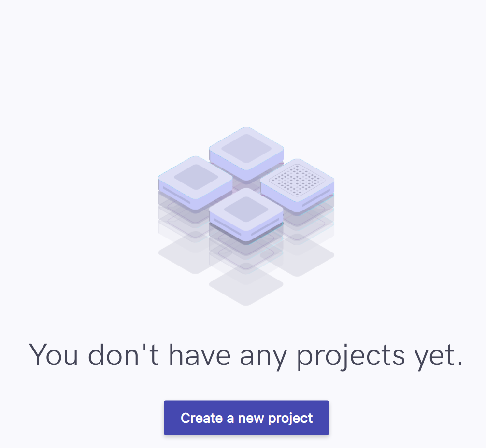
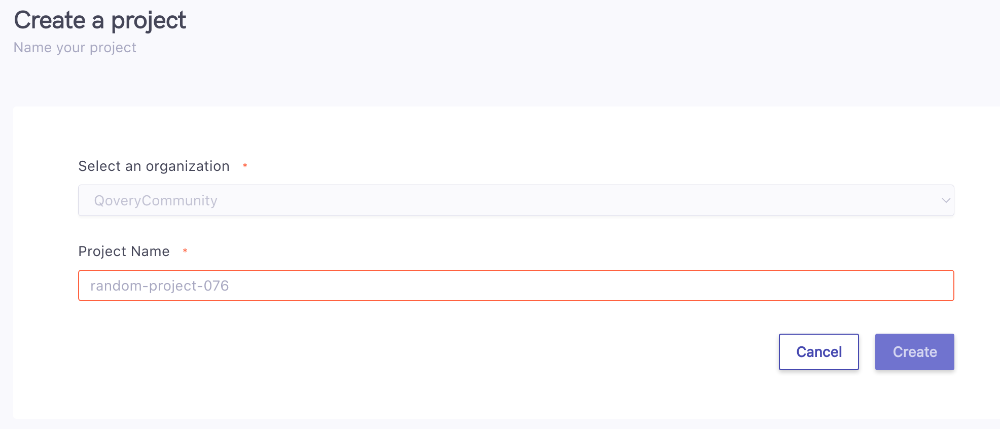
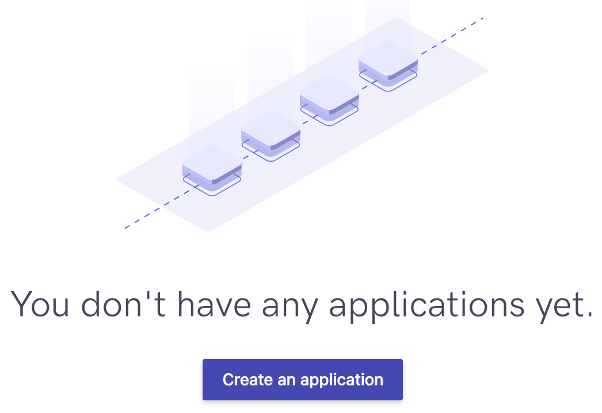
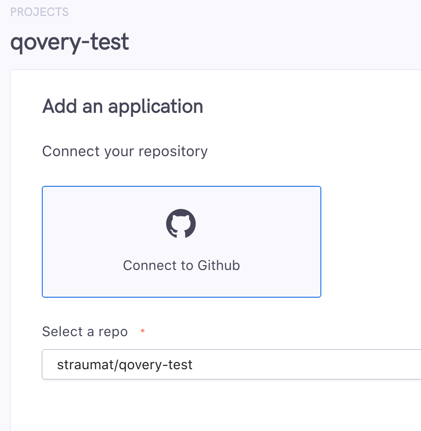
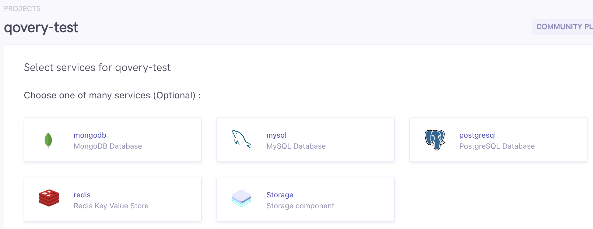
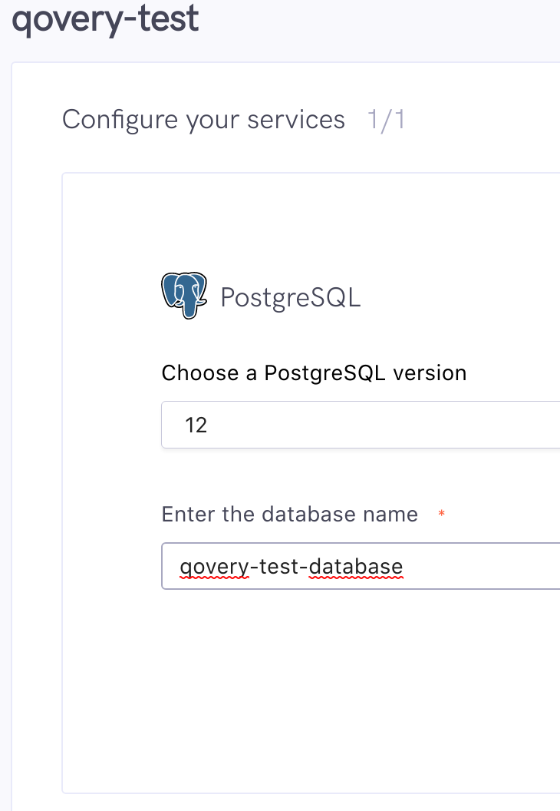
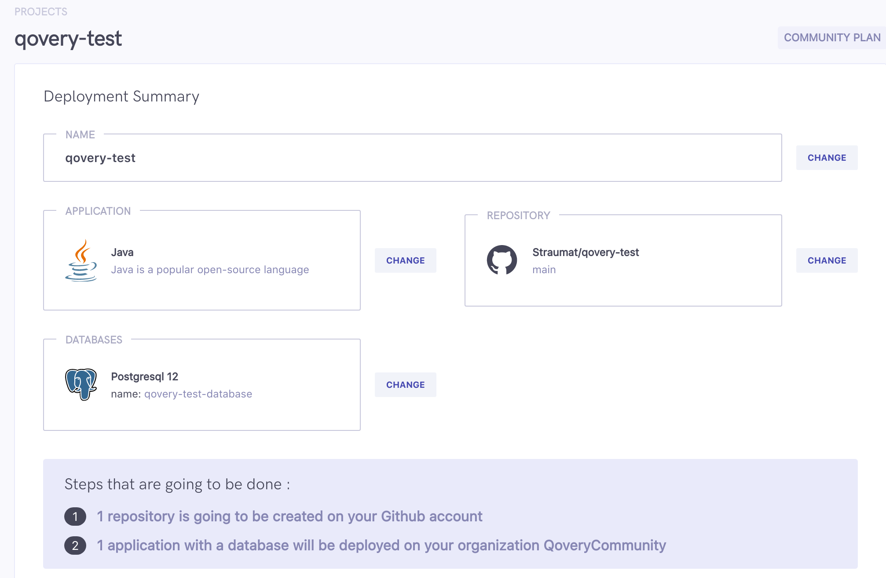

# Deploy & run with Qovery

## How it works ?
[Qovery](https://www.qovery.com/) is a startup that offers free hosting for your project (free server & a free database) with an amazingly simple way to deploy: you push your code to git and Qovery handles the rest.

This is how we use it:
  * Create a project on github.
  * Create an account on Qovery.
  * Tell Qovery which repo to use and what kind of database you need.
  * Push code to github!

From now on, everytime you will push your code to github, Qovery will package and deploy it to your server.

## Create your bot

### Create & clone the repository
On my github account `straumat`, I created a private project named `qovery-test`.

The first step is to retrieve the project from Github on your computer:
```bash
git clone git@github.com:straumat/qovery-test.git
```

### Create the bot
Create a simple trading bot using one of Cassandre archetypes:
```bash
mvn -B archetype:generate -DarchetypeGroupId=tech.cassandre.trading.bot \
-DarchetypeArtifactId=cassandre-trading-bot-spring-boot-starter-basic-archetype \
-DarchetypeVersion=CASSANDRE_LATEST_RELEASE \
-DgroupId=com.example \
-DartifactId=qovery-test \
-Dversion=1.0-SNAPSHOT \
-Dpackage=com.example
```

### Configure the bot

#### Database connection
Edit `src/main/resources/application.properties` to configure the database:, we will use environment variables that qovery will pass to our application:

```properties
# Exchange configuration.
cassandre.trading.bot.exchange.name=kucoin
cassandre.trading.bot.exchange.username=cassandre.crypto.bot@gmail.com
cassandre.trading.bot.exchange.passphrase=cassandre
cassandre.trading.bot.exchange.key=5df8eea30092f40009cb3c6a
cassandre.trading.bot.exchange.secret=5f6e91e0-796b-4947-b75e-eaa5c06b6bed
#
# Modes.
cassandre.trading.bot.exchange.modes.sandbox=true
cassandre.trading.bot.exchange.modes.dry=true
#
# Exchange API calls rates (ms or standard ISO 8601 duration like 'PT5S').
cassandre.trading.bot.exchange.rates.account=PT1S
cassandre.trading.bot.exchange.rates.ticker=PT1S
cassandre.trading.bot.exchange.rates.trade=PT1S
#
# Database configuration.
cassandre.trading.bot.database.datasource.driver-class-name=org.postgresql.Driver
cassandre.trading.bot.database.datasource.url=jdbc:postgresql://${QOVERY_DATABASE_QOVERY_TEST_HOST}:5432/${QOVERY_DATABASE_QOVERY_TEST_DATABASE_NAME}
cassandre.trading.bot.database.datasource.username=${QOVERY_DATABASE_QOVERY_TEST_USERNAME}
cassandre.trading.bot.database.datasource.password=${QOVERY_DATABASE_QOVERY_TEST_PASSWORD}
```
### Add the PostgreSQL driver
To connect to a PostgreSQL server, you need to add the JDBC driver to your project. Edit your pom.xml and add:
```xml
<dependencies>
    <dependency>
        <groupId>org.postgresql</groupId>
        <artifactId>postgresql</artifactId>
        <version>42.2.17</version>
    </dependency>
</dependencies>
```

### Configure jar final name
To make things more simple to build the Docker image required by qovery, we add this in our pom in the build section:

```xml
<build>
    <finalName>qovery-test</finalName>
</build>
```

This will ensure that the jar created by the maven process will have the name `qovery-test`.

### Dockerfile
When pushed to Github, qovery will retrieve your sources and build the Dockerfile at the root of your project.

This is our Dockerfile, it has two steps:
  * First, we use a maven docker image to build our application and creates a spring boot jar.
  * Second, we use an openjdk11 image, and we put our jar in it.

```dockerfile
# Install maven and copy project for compilation.
FROM maven:3.6.3-openjdk-11-slim as build
WORKDIR /build  
# Copy just pom.xml (dependencies and dowload them all for offline access later - cache layer).
COPY pom.xml .
RUN mvn dependency:go-offline -B
# Copy source files and compile them (.dockerignore should handle what to copy).
COPY ../.. .
RUN mvn -DskipTests=true package spring-boot:repackage

# Creates our image.
FROM adoptopenjdk/openjdk11 as runnable
COPY --from=build /build/target/qovery-test.jar app.jar
ENTRYPOINT ["java", "-Djava.security.egd=file:/dev/./urandom","-jar","app.jar"]
```

### Push to github
The last step is to commit and push the project to Github:
```bash
cd qovery-test
git add *
git commit -m "first commit"
git branch -M main
git push -u origin main
```
## Configure Qovery
Connect to [Qovery](https://www.qovery.com/) and signup, then go to the project menu and click on `create a new project`.



Enter your project name (`qovery-test`):



Now, create an application with the name (`qovery-test-app`) and choose `I have an application` on the next screen:



Then, select the github project you want to deploy to Qovery:



Choose the type of application you have (java):


Choose the type of database (PostgreSQL):



Choose the name of the database (`qovery-test-database`):



Now, check everything is ok the summary page and press create !



Qovery will now connect to your repo, creates a configuration file, creates your server and your database, retrieve your sources, build the docker image and run it ! That's it.

::: tip
Qovery added a configuration file named `.qovery.yml` at the root of your repository.
:::